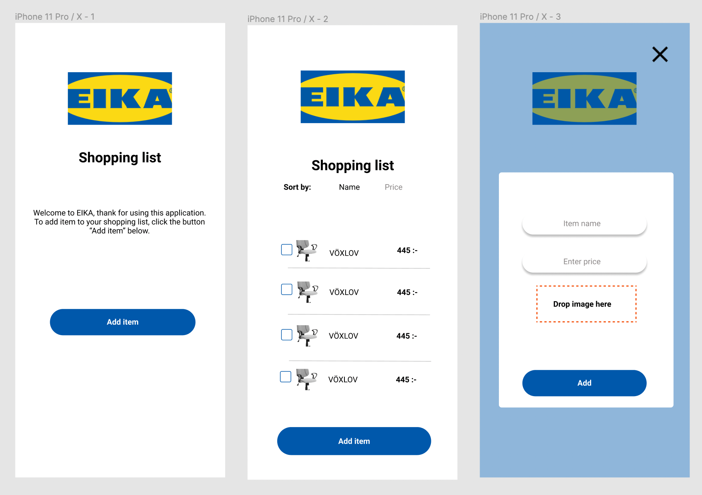
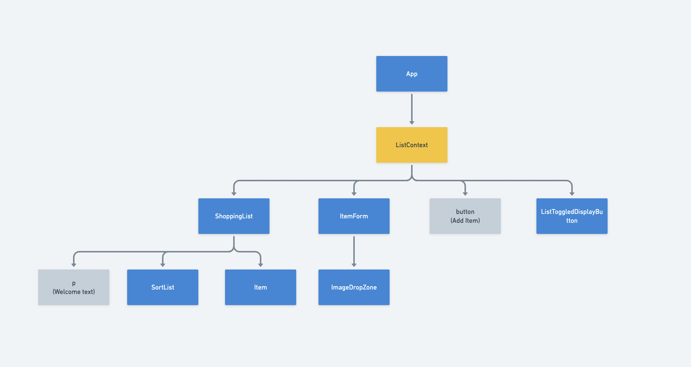

# About Eika shopping list app

This app helps you keep track of item you would like to buy at Eika. You will be able to add the name and the price of item you wish to buy. There is and optional drag a drop zone should you wish to add picture to your item.

## How to use this app

This app was create using react. If you wish to run it on your computer ensure that node js is installed on your computer and run npm install on the directory of this project on your CLI. To start the project go to the directory of this project on your CLI, enter npm start and press enter.

### Add item

Click on Add Item button to add item to the shopping list. A pop up window with name, price and a drop zone will be diplay. The price and name field are required for the add button to be active. The image drop zone is optional. You can drag and drop image there if you like to add image to your item. Field the form and click add button to the add it to the list. You should be able to see the item in the list at this time.

### Mark existing item as completed

To add item to the completed/acquired list click the checkbox button on the left side of the item you wish to add to the acquired list, the item will automatically be added to the aquired list.

### View completed items

To view completed items click on View completed items link on the bottom of the page to toggle between view items and view completed items

### Sort items

By default item list is sorted using item name. You can click sort by name or price to sort list using name or price repectively.

## App requirement
* must work on browser
* must be able to add an item name and price.
* mark a shopping item as completed/acquired.
* must be able to view completed/aquired shopping items.
* must be able to close and reopen the page without losing their list.

* able to drag a picture to each shopping list item and store it in cloud platform. 
* prevent user from uploading to larg image.

## Eika app prototype

## Eika shopping list component tree
